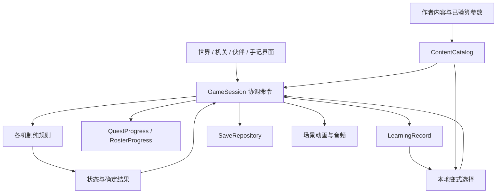

# 工程架构与数据契约

2026-09-10 实现更新：森林岛18关与正式会话、RPG、独立存档已进入引擎；当前运行事实和验证范围见[运行时与验证](runtime.md)。下文保留制作契约，历史“待实现”描述不作为当前进度，进度以唯一执行计划为准。
本文描述经代码核对的试玩现状及正式版目标架构，已同步普通关v2与首领v3（2026-09-10）。下文 `GameSession` 等名称为待实现模块，不能当作当前已有 API。采用 Godot 单进程、本地内容、本地存档，先为森林岛提供完整模块边界。

导航：现状与改造理由 → 模块与依赖 → 动作生命周期 → 关卡/事件契约 → 存档恢复 → 实施与验证。

## 1. 当前结构与保留接缝

| 现有代码 | 已有职责 | 正式开发处理 |
| --- | --- | --- |
| `game/treetop.tscn` → `scripts/cargo/journey.gd` | 多页面 UI、输入、动画时序、货运规则调用、跨场景保存 | 保持试玩入口；新入口渐进提取协调器和页面，避免继续堆叠 RPG 分支 |
| `scripts/cargo/rules.gd` | 合法搬运、升降、卸客、完成判定、当前状态 BFS 提示 | 作为 `CargoRules` 的行为基准；参数化时保留 FL01 精确配置 |
| `scripts/cargo/store.gd` | v5 聚合 cargo/encounter/声音/归来；石灵 store 适配 | 正式版由一个会话存档拥有聚合状态，旧适配仅保留于试玩路径 |
| `scripts/cargo/world.gd`、`skin.gd` | 场景绘制/命中区域；木纹、字体、纸张和按钮风格 | 分离场景视图与共享主题；保留现有画面尺度 |
| `scripts/encounter/encounter.gd`、`rules.gd` | 14 枚晶体遭遇、演出、独立状态与领奖 | 保留旧双盾试玩；复用演出资源，FL02新建三门规则与过程证据，正式主线使用统一结算 |
| `scripts/encounter/audio.gd` | 声音实例与音量；协调器切换可闻实例 | 提取会话音频入口，场景只发命名提示音；核对切场景停止旧循环 |

当前规则状态与图片分离，是应保留的基础。当前旅程用硬编码字段表达两个节点，手记通过完成布尔值推导阿橙阶段，没有队伍、经验、任务图或通用学习记录。正式版不在旧 v5 JSON 中无限追加新系统。

## 2. 目标模块与单向依赖



| 模块（拟定路径） | 拥有的数据与决定 | 不拥有 |
| --- | --- | --- |
| `scripts/core/game_session.gd` | 一个 `ProfileState`；命令顺序、当前关、保存阻塞、切场景 | 数学求解细节、美术绘制 |
| `scripts/content/content_catalog.gd` | ID 唯一、引用完整、关卡版本、伙伴和奖励定义的只读索引 | 玩家进度、动态生成规则 |
| `scripts/mechanisms/*_rules.gd` | 各机制状态、合法动作、结果与提示证书 | 文件、Node、奖励/UI、网络 |
| `scripts/progression/quest_progress.gd` | 前置任务、阶段完成、解锁事件 | 运算判定、动画回调 |
| `scripts/progression/roster_progress.gd` | 入队、羁绊事件、技能配置、经验投影 | 学习能力判断 |
| `scripts/learning/learning_record.gd` | 每次挑战及提示/迁移的事实记录 | 角色等级、扣奖励 |
| `scripts/persistence/save_repository.gd` | 验证、序列化、版本迁移、写入结果、坏档保护 | 静默改正不一致的游戏状态 |
| `scripts/ui/`、`scripts/world/` | 输入意图、可见状态、场景热点与表现 | 直接修改存档和发放奖励 |

采用显式传入会话引用和局部信号。除确有全生命周期需要的根会话外不堆叠 Autoload；不预建 ECS、全局事件总线、任意脚本规则解释器或联网后台。场景仍用 Godot 的 Node2D/Control 组合；规则采用手写机制加作者参数。

## 3. 动作、演出与奖励生命周期

一个关卡只允许一个串行操作拥有者。持久状态只保存稳定棋盘；选中、鼠标位置、悬停、Tween 进度、对话倒计时与撤销栈属于会话临时状态。

正式目标流程：`接收命令 → 校验当前关/阶段与动作 → 在副本计算下一稳定状态 → 聚合记录与结算 → 验证并保存 → 安装状态 → 播放结果 → 恢复输入`。

- 无效落点、失焦取消和 Esc 取消不生成数学动作。主动试运行失败是合法尝试，保留棋盘并记录具体条件未满足。
- 保存成功前禁止切场景、继续发命令或呈现已领取奖励。保存失败保留旧已提交状态和待提交副本，显示“未保存，重试”；重试提交同一候选，不再次加经验。
- 保存成功后崩溃或演出中退出，恢复到提交后的稳定状态；可跳过动作演出。领奖对话是可重看的表现，不是发奖励的第二个入口。
- 奖励和“完成事件”同一次提交，唯一键为 `profile + reward_id`；ID 跨重试、回访和内容小修不变。内容 revision 不能成为重领奖条件。
- 撤销仅回退当前未完成机关的数学状态，不撤销提示已使用的事实，不回退已结算阶段的奖励。重摆需玩家确认；当前挑战的提示与试运行次数保留。
- 多阶段首领在阶段边界保存；第一阶段确定的第二阶段参数写入同一 `ChallengeRun`。第二阶段不能根据每次重开重新抽参数。

这是正式版目标，**不同于旧货运动画结束后再保存的时序**。迁移必须显式覆盖保存失败、动画中中断和重复领奖的回归，不把旧测试直接当作新事务流程证据。这里要求逻辑完整保存，不宣称对设备突然断电的持久保证。

## 4. 数据与机制契约

作者定义只读，运行状态单独保存。`forest_levels.json` 是设计/验算数据，尚未由 Godot 加载；进入内容化阶段再将其转换为正式 `LevelDefinition`，保留稳定 ID 和参数身份。

| 对象 | 必要字段与约束 |
| --- | --- |
| `LevelDefinition` | `level_id`, `revision`, `scene_id`, `mechanism_id`, `params`, `prerequisite_events`, `concept_ids`, `hint_ids`, `reward_id`, `completion_contract`；所有引用存在，前置无环 |
| `ChallengeRun` | `run_id`, `level_id`, `content_revision`, `variant_id`, `phase`, `params_snapshot`, `secret_case_id`, `opponent_seed`, `certificate_draft`, `state`, `attempt_count`, `highest_hint`, `outcome`；开始后参数冻结 |
| `RuleResult` | `accepted`, `state`, `outcome`, `feedback_code`, `facts`；失败不带部分修改的权威状态；合法未解与非法动作分开 |
| `Completion` | `run_id`, `level_id`, `phase`, `solution_facts`；只由规则结果生成，UI 不可自报成功 |
| `RewardDefinition` | 稳定 `reward_id`、经验、木片、道具/事件列表；内容加载时拒绝负值和未知 ID |
| `LearningObservation` | `run_id`, `concept_id`, `context_id`, `variant_id`, `outcome`, `highest_hint`, `support_used`, `evidence_kind`；没有儿童姓名/自由聊天字段 |

各机制提供等价接缝：`fresh(params)`、`validate(params, state)`、`apply(params, state, action)`、`evaluate(params, state)`、`hint(params, state, tier)`。返回的提示须来自当前合法状态，不能照抄初始解的下一步。不同机制保留各自的数据类型，不强行用同一种棋盘数组。

边界校验覆盖 JSON 整数/有限值、物件唯一归属、数量守恒、阶段一致、合法伙伴/装备、唯一奖励、依赖事件、参数版本和存档 schema。内部纯函数接收已验证参数；不在每个渲染帧重复加载和验证内容。


### v2 过程证据与未知情形

`completion_contract`明确棋盘达成与过程证据两个条件。UI提交玩家构造，机制校验器结合本次固定参数重新计算；不能让UI直接写`understood=true`或只凭找到一份参考解发奖。合法替代表达按契约接受，提示帮助完成同一证据，不降低奖励。下列接缝尚待引擎实现，Python设计验算器不等于运行时校验器。

| 证据类型 | 校验内容 | 主要使用关卡 |
| --- | --- | --- |
| `TransferCertificate` | 原分配、前后状态、守恒及约束对应的时刻；由动作重算每一步 | FL02/03 |
| `CountingCertificate` | 光带重复计数或互斥穷尽分类；不能仅提交最终总数 | FL04/08 |
| `CandidateCertificate` | 候选集对全部记录成立；排除理由确实击中一条约束，信息不足时保留全部等价候选 | FL05/07 |
| `ProbeCertificate` | 试验前对所有候选的预测、结果到候选的映射；每种可能观测都能唯一识别 | FL06 |
| `RouteCertificate` | 单路合法、去重、配对冲突、完整集合或最优比较；坐标与步骤身份一致 | FL08–10 |
| `PlanCertificate` | 可执行规划和下界/不变量/最优比较；分支计划覆盖所有合法隐藏情况 | FL11/13–16 |
| `StrategyCertificate` | 起局和玩家配置的应对规则；枚举所有可达对手选择 | FL12 |
| `BattleTranscript` | 玩家动作、敌方回应、资源花费、有效观测、阶段与最终结果；验证实际回合，不要求玩家填全策略表 | FL17/18 |

证据草稿、尚未排除的候选、回响记录、分支树及阶段完成标记都随`ChallengeRun`保存。重新进入恢复同一隐藏情形和规则；不能通过重载更换机器或天平答案。秘密情形仅影响演示观测，不替代必须覆盖所有情形的计划任务。

FL11比旧cargo增加`max_items_per_basket=2`、`max_basket_weight=4`、`lock_delivered=true`，每关参数固定；三项全部到站后才完成。到站者退出由规则处理，不能只是隐藏精灵而仍允许重新装载。旧FL01不带这些约束，FL13只带容量2。

FL12继续使用取物规则和全回应策略板。FL17/18改用独立战斗机制，移除原分堆/最后取物判定；旧首领revision不能用新规则解释。首领通过本盘有效轨迹和场景目标胜利，作者离线验证全部敌方回应/隐藏真身；实际仅经历的一个分支不能标为掌握全部策略。

FL17的战斗状态包括`energy`、`remaining_cards`、`turn_index`、`enemy_response_id`与回应已应用状态。首回合的玩家转移和必然触发的敌方回应在同一次稳定提交中计算、扣符并落盘，之后分段播放；读档不能重复交换B/C。封盘、负数和重复用符在规则边界拒绝，不能只依靠UI禁用。

FL18包含`secret_form_id`、`seed_balance`、`active_observations`、`probe_count`与`battle_phase`。候选集合从当前有效观测重算；若存档也保存候选，必须与重算一致。侦察次数/花费/观测与候选变化同时提交。撤销同时回退这些字段，历史战报不作为当前合法观测；否则会产生免费情报。真身不会因撤销或读档改变。历史观测与`rewind_count`保留在尝试记录中，`replanned_after_observation`与主动提示层数分别记录；有效观测回退不意味着玩家忘记此前情报。战斗胜利不要求首次无撤销规划，但学习记录不能把再规划标成首次保证成功。

未唯一辨明真身时拒绝`finish`，侦察即使输出20也不能触发胜利。合击消耗同一库存，输入须在2–8且余额足够，实际输出恰20才允许胜利事件。显示给玩家的状态不提前暴露真身或最优选择。战斗的具体规则和表现约束以 [首领战v3](boss_battles.md) 为准。

## 5. 正式存档与兼容

拟用 `user://profiles/local-1/save-v1.json`，单本地档槽起步，不需要登录。`schema_version=1` 表示正式格式，与旧 demo 文件中的 `version=5` 不构成大小升级关系。

```json
{
  "schema_version": 1,
  "content_revision": "forest-2",
  "profile_id": "local-1",
  "revision": 0,
  "world": {"location_id": "camp", "events": []},
  "progress": {"completed_levels": [], "claimed_rewards": [], "journey_exp": 0},
  "roster": {"owned": ["acheng"], "party": ["acheng"], "bonds": {}, "loadouts": {}},
  "inventory": {"camp_wood": 0, "unique_items": [], "buildings": []},
  "active_run": null,
  "learning": {"observations": []},
  "settings": {"muted": false, "volume": 0.7}
}
```

示例是字段形状，不是已经实现的 schema。新档初始化用明确角色定义补齐初始技能；加载不能将缺失字段默默填为“已成功”。`revision` 每次稳定提交加一，用于拒绝过期的 UI 命令；首次挑战的 `run_id` 在保存之前建立，重试复用。

写入目标：校验候选 → 同目录临时文件 → flush/关闭并检查错误 → 替换正式文件。新实现需验证目标平台的替换与失败行为。上一个已知可读版本可保存为备份；若启用备份，明确恢复选择，不自动回滚玩家奖励。未知版本、损坏 JSON、非法引用均保护原文件，给出返回/重试/另建新档的可见路径。

v1–v5 试玩档继续由各旧入口读取。首个正式版从独立档开始；**不自动导入** v5。之后如制作导入：只复制经校验的完成事件、对应纪念物与声音设置，保留来源；不能由旧布尔值伪造正式经验或独立学习证据。旧双盾成功与v2三门借光不等价，最多导入旧信物纪念记录，不能据此标记FL02完成或跳过其新入队事件。导入失败不得改写源档。

活动关卡保存参数快照与内容版本。小版本升级应保留活动 revision 的规则解释或提供显式迁移；无法解释时暂停该关并保护数据，不能拿新版规则直接解释旧棋盘。

## 6. 渐进实施与最窄验证

先提取正式会话/内容/存档边界，再做阿橙养成闭环，之后迁移 FL01并新建FL02三门机关，最后按关卡依赖扩充。以新场景 `game/forest_release.tscn` 并存开发；完成首个正式可玩闭环和相关回归后再切默认入口。历史场景仍可单独运行。

| 改动 | 必须验证的行为 |
| --- | --- |
| 规则参数化 | FL01 与旧输入逐步结果相同；新参数可解；死局提示确实可恢复 |
| 会话/存档 | 全新档、读回、坏档保护、写失败重试、结算重复提交、过期命令、半阶段中断 |
| RPG/经济 | 提示和失败不减奖励；首次领奖唯一；同伴加入追平经验；装饰购买不能阻塞主线 |
| 新关卡 | 真正投递输入；错误反馈；撤销/提示/重摆；构造/过程证据缺失或错误不得结算；完成和中断恢复；数学结果与验算一致 |
| 新 UI/演出 | 1280×720 与960×540；模态和失焦；单可闻环境循环；跳过演出后状态一致 |

规则/数据检查使用 headless 或 Python；窗口交互需真实 Godot 窗口。数学通过、窗口通过、美术 QA、真人试玩和发布验收分开报告。新存档和事务属于风险较高的最终候选，完成时按实际候选运行一次 code-review，并对具体恢复风险补验证。
