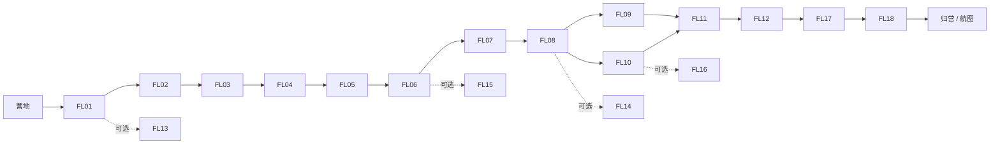

# 森林岛：林间来信 · 关卡设计 v3（首领专项）

2026-09-10 实现更新：森林岛18关与正式会话、RPG、独立存档已进入引擎；当前运行事实和验证范围见[运行时与验证](runtime.md)。下文保留制作契约，历史“待实现”描述不作为当前进度，进度以唯一执行计划为准。
日期：2026-09-10。用户要求以小学奥数入门的思考强度重做关卡，并明确否定旧 FL02。本轮按首领趣味/推理/更高难度要求，将FL17/18进一步修订为v3，FL01–16保留v2；当前文本替代旧关卡制作契约；v0.5.2 试玩继续独立保留。FL01 继承试玩货运，其余正式机制或判定均需新制作/扩展，尤其 FL02 不再使用 14 枚晶体的双盾分配题。
2026-09-19 修订（v4）：试玩复核认定 FL04/06/07/09/11/16 思考强度不足（界面代算或一手牌太松），FL12 策略提示改为按需获取。FL04 合重改 29/35/30 并移除逐对实时对照；FL06 恢复“试验前预测”为硬性要求；FL07 手牌换 1/4/5/9；FL09 落石先预测后揭示；FL11 换为四件上行货对三块配重的七件清单；FL16 通关须试齐全部宽度并围定真最优；FL12 棋盘不再常驻策略句。旧完成记录经旧参数回落保持有效，进行中的旧参数现场归档重开。

导航：设计标准 → 关卡路线 → FL02 专项 → FL01/03/04 → 磨坊 → 邮路 → 货运与策略 → 支线 → 首领 → 验算和制作。

参数与三级提示的机器可读原稿：[forest_levels.json](forest_levels.json)。结果：[math_verification.json](math_verification.json)。工程与进度分别见 [架构](architecture.md) 和 [执行计划](../试玩实现计划.md)。

## 1. 这次提高什么

目标是在小学二至三年级已有加减、整数分组经验上，引入奥数入门的关系发现、逆推、分类、最优性和对策。只会算出结果不一定能完成一个机关的推理任务；同时允许试验、撤销、主动提示和辅助完成。教学负责解释对象与操作，完整关卡仍需要思考。

每关明确四项：**必须发现的关系、需要检查的简单策略、可操作的推理证据、相对前关新增的要求**。这些是设计与验算对象，不是已经测得的儿童难度等级。

- 原关卡出现的“一趟运完”是合法解，保留在 FL01；FL11 用四件上行货对三块配重的计数缺口与公开的载重、到站退出规则形成真正的新规划。
- 磨坊三关分别考查约束交集、试验选择、信息不足，固定运算链只作工具示范。
- 邮路从互斥穷尽分类，推进到最优阻断位置、两条路线之间的共同约束。
- 普通策略关的策略板要求应对不同合法回应，不能以同一对局顺序反复获胜替代。
- FL17在有限转移符和封盘中接住石灵换盘；FL18把试探信息、有限种子与最终合击连起来。观察、选择和推理发生在真实回合中。

普通关首次通关需要本关规定的构造/推演证据；首领按有效战斗轨迹与本盘胜利目标判定，不要求战前填写全策略表。使用提示可以逐步完成同一任务，奖励相同。证据由玩家摆放、分组、连线、选择反例或分支应答生成，规则校验其内容。没有“我懂了”按钮或必须输入长篇文字的证明。参考解不排斥其他满足任务契约的表达；只有确实唯一的数学量才比较唯一答案。

## 2. 故事、路线与整体分工

送种后，小岚和阿橙发现森林各处的规则并未失效，居民丢失的是连接线索、规划后续的方法。玩家帮助石灵恢复三门回响、还原粮仓账目、辨别磨坊机器、组织邮路，最后借力通过石灵试炼，识破树心幻影，与伙伴一起唤醒春天。

FL11 的双入边为 AND；FL09、FL10 均完成才开放。FL15 改为 FL06 后开放，承接“试验应区分候选”的概念。四条支线不阻塞主线；稳定奖励 ID、入队与建设里程碑仍保持原编号绑定。

| ID | 关卡 | 思考核心 | 相对 v1 的处置 / 世界回报 |
| --- | --- | --- | --- |
| FL01 | 第一袋种子 | 批量比较与合法多解 | 保留试玩入门；种子到站、阿橙经历1 |
| FL02 | 石灵的三门借光 | 动态转移、守恒与反向状态恢复 | 全部重做；石灵信物、苔团加入 |
| FL03 | 借粮之前的三座仓 | 同一对象在不同时间的联合条件 | 重做；粮仓恢复、苔团经历1 |
| FL04 | 三架灯的秘密 | 重复计数与等量代换 | 将原支线核心带入主线；屋顶建设开放 |
| FL05 | 残缺的磨坊账簿 | 联合记录排除机器装法 | 重做；磨坊第一段恢复 |
| FL06 | 只能试一次的育苗机 | 选择有区分力的试验 | 重做；阿橙经历2、前后手记 |
| FL07 | 磨坊的24点 | 四则运算组合与括号 | 四卡全部使用、精确得到24；磨坊开工、邮路开放 |
| FL08 | 不会漏信的分邮袋 | 路线的互斥、穷尽分类 | 加强；折羽加入、工台建设开放 |
| FL09 | 落石放在哪里 | 路线补集与最优位置 | 重做；居民获得最佳绕行布局 |
| FL10 | 互不碰面的两封信 | 两路兼容与无序配对 | 重做；邮亭营业、试走影子 |
| FL11 | 轻装才有下一趟 | 四货三石的拼趟计数、不可回收配重与未来步骤 | v4重做货单；货运恢复、苔团分组带 |
| FL12 | 守门人的三种回应 | 起局选择与完整应对策略 | 加强；阿橙经历3、成长事件开放 |
| FL13 | 两趟足够吗 | 最优构造与容量下界 | 保留支线核心；货运纪念物 |
| FL14 | 偶数也到不了的石径 | 奇偶以外的步数约束、最小修改 | 加强；石径拓印 |
| FL15 | 两次称量找出异晶 | 三分支决策与最坏情况保证 | 重做；异晶收藏 |
| FL16 | 借一道墙的花圃 | 三边耗材与完整最优比较 | 重做；花圃设计图 |
| FL17 | 风枝石灵·借力破阵 | 有限手牌、封盘与换盘后的应对 | v3重做；折羽经历、树根化桥 |
| FL18 | 雾冠树心·唤醒春天 | 条件试探、信息与资源保留、逆推合击 | v3重做；航图、苔团经历、树心复苏 |

两个启程关的分类仍使用数据 `intro`，表示位置与操作引入，不表示低思考强度。其后为10个主线、4个支线、2个首领；主线共14关。主要关卡4–8分钟仍是待观察目标，不能靠增加重复搬运来填时长。

## 3. FL02 专项：石灵的三门借光

### 玩家看到的问题

石灵面前三门分别为左、中、右，共有24枚晶体待安置，每门初始至少1枚。三声回响必须按可见的环路依次发生：

1. 左门借给中门 **与中门当时晶体数相同的数量**。
2. 中门借给右门 **与右门当时晶体数相同的数量**。
3. 右门借给左门 **与左门当时晶体数相同的数量**。

收光门因此翻倍，送光门减少同样数量，总量始终24。送光不足则这一声不能执行；不会出现负数或凭空生成晶体。玩家安排**初始**数量，使三声结束后三门恰好各有8枚。

### 为什么需要推理

一次操作改变两门，下一次转交量又依赖刚刚改变的数量。将初始直接摆为8/8/8会得到错误终态；对某一门持续增减没有单调的成功方向。玩家需要跟踪整条变化，或从目标倒放，理解“翻倍”的逆过程与守恒关系。

唯一初始状态是 **11、7、6**：

| 状态 | 左 | 中 | 右 | 本次实际转交 |
| --- | ---: | ---: | ---: | --- |
| 初始 | 11 | 7 | 6 | — |
| 第一声后 | 4 | 14 | 6 | 左→中7 |
| 第二声后 | 4 | 8 | 12 | 中→右6 |
| 第三声后 | 8 | 8 | 8 | 右→左4 |

倒放则是 `8/8/8 → 4/8/12 → 4/14/6 → 11/7/6`。关卡教学只演示“收光方得到与现有数量一样多的晶体”这一操作，用独立小样板展示2收到2；不预演本题的分配或倒推解法。

### 操作、反馈与完成条件

玩家可用晶体组调整三门数量，一次试运行依次显示三个状态；失败保留初始方案与回响记录，允许比较前后。动画搬运数量由规则提供，玩家不需要亲手拖动每枚飞行晶体。

完成包括正确的初态/正向回响，以及在倒放板恢复最后两次回响的前态（4/8/12、4/14/6），让“结果碰巧正确”和“过程构造完整”有不同记录。需要帮助时可以沿三级提示完成，仍取得信物并让苔团加入。

三层提示：最后一声影响哪两门 → 倒放时收光门将一半退回，第三门不变 → 示范最后一步倒放得到4/8/12。第三层之后仍可逐步请求当前关键动作，所有帮助记录在本次挑战中。

**验算范围**：枚举正整数初态，唯一解及完整正/反轨迹成立；8/8/8作初态被拒绝。尚未实现三门场景与过程证据校验器，不能复用旧双盾的窗口验收作为新关验收。

## 4. FL01、FL03、FL04：从整批到联合条件

### FL01 第一袋种子

保留 v0.5.2：重量依次为阿橙2、小岚3、种子1、配重2/3/4；两篮重侧下降、靠站装卸、到顶卸下前三项。没有件数和总载重上限，合法一趟解是左篮装全部旅客/种子6，右篮装全部配重9。

这关承担场景操作与批量比较入门，多趟成功也能通关。关后手记邀请比较运输安排，不要求证明不存在其他路。三趟参考流程继续有效，但不再把“为回程预留配重”写成本关必需思考。三级提示和当前状态恢复沿用已验证规则。

### FL03 借粮之前的三座仓

三仓共30袋，初始每仓至少1袋。甲给乙4袋后甲乙相等；**接着**乙给丙3袋后乙丙相等。玩家恢复原分配并给两条“相等”线索标注时刻。

唯一初态16/8/6；中间12/12/6；末态12/9/9。第一条成立不代表第二条也成立，不能将两个相等同时写在初态。用时间板将记录连到对应三仓快照，正向转移和时间关系都吻合才完成。奖励与苔团粮仓经历保留。

提示：两句话是否同一时刻 → 第二次转移后甲比乙多出的量来自哪里 → 末态12/9/9的一个倒放步骤。此关强调区分时刻与条件，承接 FL02 的状态恢复，但不复制“目的门翻倍”。

### FL04 三架灯的秘密

三架灯的能量未知，合点两架得到 A+B=29、B+C=35、A+C=30。每架为1–20的整数能量。玩家用三条光带表示各次合点，恢复A12/B17/C18。

推理板把三条光带合并，再将每架重复出现的两次配对，得到三架总量47；分别减去已知的一对得到单架。两位数合重下，逐架试数的代价远高于先求总量；棋盘不再逐对显示“现在/目标”的实时对照，调好后点亮才揭晓。三对同时满足与重复计数表示共同完成任务。第三层提示只展示一次“总量减一对”，可继续请求其他步。此关将原较有价值的支线代换思路带到主线，完成后开放屋顶建设。

## 5. 磨坊：FL05–FL07 分别增加不同要求

### FL05 残缺的磨坊账簿

机器有两个有序插槽，从 `+2、+5、+7、×2、×3` 五块模块中选两块，每块最多用一次。两条旧记录是 `投入2→产出8`、`投入5→产出17`，必须由同一装法解释。

唯一装法为 **先×3，再+2**；新投入6应得到20。只看第一条留下2种装法，只看第二条留下4种，两条共同作用才唯一。玩家给被排除的装法贴上违反的记录，在新投入前作预测，再试运行。

提示从“两个记录来自同一机器”递进到保留候选，最后用“+2再×2符合第一条却不符合第二条”作反例。固定三步逆运算不再是一整关的核心任务。

### FL06 只能试一次的育苗机

另一台待辨认机器只有三种可能：A为先+2再×2；B为先×3再+2；C为先+5再+7。封存的实际类型在本次挑战开始时固定。试验板只能投入2、5或6，须设计一次就一定辨认的试验。

| 投入 | A输出 | B输出 | C输出 | 是否保证区分 |
| --- | ---: | ---: | ---: | --- |
| 2 | 8 | 8 | 14 | 否 |
| 5 | 14 | 17 | 17 | 否 |
| 6 | 16 | 20 | 18 | 是 |

2026-09-19 起，棋盘不再代算三台对所选投入的输出，也不替玩家判断“能否区分”。投送前必须为三台各摆一条自己的预测；三条预测里有相同结果时投送被拒（这包种子自己就分不清）。投送后逐台对答案，预测与实际不符时指认被拒，须撤销试验、算准后再投。选择6并在预测全部与实际吻合后指认才完成。试验次数是机关的公开任务条件，计划可自由重摆、失败可重开，没有资源损失或奖励惩罚。阿橙前后手记在本关结束解锁；本关自带预测板，不依赖尚未取得的伙伴技能。

### FL07 磨坊的24点

用户于2026-09-16明确要求替换原中间记录关。本关现在使用四张数字卡 **1、4、5、9**（2026-09-19 换入，原 2/3/4/6 的验算确认存在28种解、两卡直乘即可得24，过松）：每张恰好用一次，只允许加、减、乘、除，最终只留一个精确等于24的值。这手牌没有两卡直乘24的捷径（5×4、9×4等第一直觉都无法收尾），共3种解法且全部为整数运算，例如 5×(9−4)−1 或 (4−1)×5+9。

交互为依次选择两张卡，再点运算符；结果合成新卡，携带完整括号算式。减法和除法按选择顺序计算，可交换两个操作数。允许负数、零与分数中间值，拒绝除以零。支持撤销、确认重摆和当前状态提示；只把部分卡算成24不能通关。任意合法解均接受，不绑定唯一答案。

故事：最后一架育苗机需要24点能量。四张卡合成24后，按玩家实际算式显示能量结果，磨坊启动，接到折羽的邮路事件。

原 FL07 的首通奖励与前置保持不变。旧 `machine_ambiguity` 定义冻结在 `legacy_fl07.json`，仅用于旧记录校验；未完成的旧现场先原字节备份，完整旧run归档后迁为新24点棋盘。已完成旧关的奖励、学习记录和剧情收据保留，不能当作已解过24点；回访新题不重复发首通奖励。

## 6. 邮路：FL08–FL10 的分类、比较和联合约束

所有网格从(0,0)到右上，只能R（右）或U（上），坐标和路径字符串由引擎准确表示。路线身份是完整步骤串，反复画同一路不增加进度。

### FL08 不会漏信的分邮袋

3×2格有10条路线。把它们按**第一次向右的高度**装入三只邮袋：高度0为6条、高度1为3条、高度2为1条。袋口由玩家放置对应前缀，后续分叉生成自己的路线卡。

完成需10条去重路线与正确分袋。检查每条唯一归袋、所有可能高度均覆盖；只凑到10不算完成分类板。手记用“每条路都必须第一次向右”解释分类为何不重不漏。提示逐步定位首次R及其后的分叉。折羽在整理好完整邮袋后加入；预测/分类基础工具一直由场景提供。

### FL09 落石放在哪里

3×3格原有20条路线，村民必须在(1,1)、(1,2)、(2,1)、(2,2)中选择一个中间点安置落石，经过该点的路线不可用。目标是保留最多送信方式。

四种方案分别剩8、11、11、8条；最优有两个位置(1,2)、(2,1)。2026-09-19 起，猜测之后须先给四处各写一条“留下几条”的预测，写满四处才揭示实际条数；预测与实际逐处对照显示，通关要求四个预测全部正确且选中最优位置。玩家将路线分为经过/未经过两类，并把经过点的路线拆成前后两段组合来支撑自己的预测。只演示一条绕行路不足以达到“最多”。同样好的两个方案均接受，不能只校验一个作者坐标。

### FL10 互不碰面的两封信

3×2格中，两只邮鸟同时各走一条最短路线，只允许共享起点和终点，不能共用任何中间顶点。鸟的身份互换视为同一组，要求找齐所有兼容的路线对。

10条单人路线产生45种无序配对，其中仅6种兼容：

| 下方路线 | 可配的上方路线 |
| --- | --- |
| RRRUU | URRUR、URURR、UURRR |
| RRURU | URURR、UURRR |
| RURRU | UURRR |

玩家可以固定一条、排除与其冲突的路线，构造三类共6组。路线卡突出共享的中间点，帮助解释“单独能走”和“两路能一起走”的差异；没有真实速度或碰撞时机要求。完成后开放折羽试走影子。

## 7. 回访货运与策略：FL11–FL12

### FL11 轻装才有下一趟

2026-09-19 重做货单。试玩确认旧“三人三石”玩法的全部解空间就是按大小逐人配对的三趟体力活：设计中的“贪心同送死局”只咬想省趟数的玩家，而这关要求正好3趟，无人有动机拼趟。新货单让一人一石在计数上不可能：

上行货四件——**阿橙2、小岚3、种子1、折羽的邮包2**；配重只有三块——**5、4、3**。货运站公开三项条件：**每篮最多2件、每篮总重不得超过5、到站的旅客与邮包进入树屋，不能重新上篮**。槽位、载重牌和到站退出动画明确表达规则；撤销/重摆仍可回到此前状态。

完成要求**恰好3趟**送齐四件。四件货、三块配重、每趟至多两件同篮：必然有一趟两件拼着走（一人一石的旧走法在第四件货处无石可用，验算确认最小解中不存在任何一人一石清单）。一条无需撤销的计划：

1. 左篮装阿橙2与种子1，右篮装5号配重；右沉左升，阿橙与种子到站，5号石落在下方。
2. 下方卸下5号石，右篮装小岚3，上方左篮装4号配重；左沉右升，小岚到站。
3. 下方左篮卸下4号石、装邮包2，上方右篮装3号配重；右沉左升，邮包到站。

为什么不能两趟：小岚与任何同伴拼趟都拉不动剩下的组合（小岚+邮包=5 无更重的下行篮；两件拼趟后余下两件仍需更重的配重）。为什么不能浪费大石：把5号石喂给种子、邮包或阿橙单独上行，小岚与拼趟组合就再也凑不出更重的下行篮，形成枚举过的死局。最小解共有7种不同的拼趟清单（阿橙+种子、小岚+种子、阿橙+邮包、种子+邮包均可作拼趟，视配重分配而定），足够探索但不冗余。

“先把大石用掉”的首趟确实形成已枚举的死局。提示先问“四件货几块石”，再揭示拼趟必然性，最后示范当前状态的一步。苔团分组带及货运经历在完成后解锁；分组带与“拼趟分组”的玩法同源。

### FL12 守门人的三种回应

取物规则为每次1–3，拿最后者获胜。策略板给13、14、15三个起局，玩家分别选择取1、2、3留下12；当对手从12取走1、2、3时，需分别回应3、2、1。

策略板与完整对局共同完成。对手在有必胜动作时使用必胜动作；在所有动作都无法保证获胜的局面，使用覆盖不同合法取数的作者分支，不固定总取1。分支/种子在本次挑战中固定并保存，不能加载重抽。关键应对板验证全部回应，不能靠一个固定种子承载策略验收。2026-09-19 起，棋盘不再常驻“逼到4的倍数”策略句；该洞察改由提示层（H 或三级提示）按需给出。

“先取1再一直取3”的脚本已有合法反例，不能保证获胜。提示可引导从4颗向前找分组，但不自动替玩家补全整个应对表。阿橙第三次羁绊与成长事件保留。

## 8. 四条支线：FL13–FL16

### FL13 两趟足够吗

沿用容量2件的货运变式，**没有 FL11 的总重4和到站退出限制**。最少两趟：先左装小岚+阿橙5、右装3+4配重7；到站后左装2配重，右到下卸配重并装种子1，再由左2拉右1上升。

构造之外，用三个要送对象与每篮两位说明一趟不可能。此关在 FL01 后即可访问，承担最优性入门；与 FL11 的不同结论来自公开规则的变化。

### FL14 偶数也到不了的石径

从0开始，限定0–10，每步±2，**恰好5步**，分别判断8、9、10是否可达。结果为否、否、是；完整可能终点为2、6、10。

奇偶只排除9，不能排除8。从全向右终点10出发，每把一步+2改成−2，终点减少4，得到额外的步数关系。玩家构造10的轨迹、给8与9匹配各自排除理由，再以最少一步替换把目标9变为可达：四步+2、一步+1。至少改一次的下界来自原任务不可达。

### FL15 两次称量找出异晶

9颗外观相同晶体中恰有1颗更重，其余同重，重晶体必定更重而不是轻重未知。用至多两次天平称量设计一个保证找到它的方案。每次有左重、右重、平衡三种结果。

参考方案先3对3；左重/右重/平衡分别留下对应3颗，再1对1定位。玩家构造三个分支，验证同一计划覆盖所有9种隐藏位置；只在当前秘密位置碰巧找到不够。一次最多3种结果不足以区分9种位置，构成“两次必要”的说明。两次是任务约束，计划和分支板可自由修改、提示不扣奖励。

### FL16 借一道墙的花圃

已有足够长的直墙作长方形一边，用12单位围栏围另外三边，边长为正整数且用完围栏，求最大花圃面积。宽是垂直墙的两边，长是平行墙的另一边。

五种(宽,长,面积)为(1,10,10)、(2,8,16)、(3,6,18)、(4,4,16)、(5,2,10)。最优3×6，面积18；沿用“选正方形”只能得到16。2026-09-19 起通关收紧：五种宽度必须全部试齐（每种宽度都会自动记成方案卡），且围定的必须是全部宽度里真正最大的方案——只比过三种就围16不再能通关。玩家逐项核对三边用料，并解释宽增加1时长必须减少2。收藏图可用于后续花圃表现，不改变主线建设花费。

## 9. 首领战：读招、布局与合力反击

完整出招、角色性格、伙伴行动、反馈和存档规则见 [首领战v3](boss_battles.md)。两战不再使用分堆取物题；FL12的普通策略关保留。

### FL17 风枝石灵·借力破阵

三能量盘初始2/8/11，目标同时7。手中1/2/3三枚转移符各用一次，三回合依次封A/B/C；每回合只能在未封的两盘之间转移对应数量。首回合后石灵可能跺脚保持数量，或甩叶交换B/C能量，招式固定在本局但在发生时才揭示。

能应对两种招式的首步为用1从C移到B，得到2/9/10。若跺脚，后两回合用3做C→A、用2做B→A；若换盘成为2/10/9，则改为用2做C→A、用3做B→A。三盘同步7后，由玩家触发合力反击，石灵抬起树根让路。

先把中盘调到7会用尽所需后手；固定使用同一个后两招顺序不能同时应对两种敌招。六种合法首步与两种回应均已枚举。战斗不提前显示正确手牌，也不要求填完策略表才播放演出。

### FL18 雾冠树心·唤醒春天

树心的四种可能回声方式分别为2x+4、3x+2、x+12、4x−8，真身在本局固定。玩家共有15颗种子，最多用两次2/5/6颗的侦察包辨明真身；每次试探消耗种子并产生真实回响。只有有效观测留下唯一候选，才开放2–8颗的蓄力合击。

合击需回响恰20，各形态分别需要8/6/8/7颗种子。在无此前真身观测、无撤销的一次连续规划中，能覆盖全部真身的首包为2或5，根据实际回响决定是否还需一次试探。这个范围内，首包6可能需要再花2才辨明A/D，此时只剩7，若为A便不足以完成合击。撤销后利用先前情报重新规划仍然允许，须另记为基于反馈的再规划。玩家必须将获得的信息与留下的资源一起规划。

幻影消散、种子库存缩小、芽眼露出与最后的合击发生在场景中，不另填整张候选表。侦察回响恰20不等于胜利；通关要求雾壳已辨明和有效合击。数学求解器覆盖所有真身与条件策略，实际学习记录仅反映玩家本盘经历。

## 10. 验算、自检与制作边界

普通关v2与首领v3验算除参考答案外，检查了具体简单策略反例：FL02初始均分失败；FL03只用第一时刻有多个候选；FL05单条账簿不能唯一确定；FL06随便试2/5可能分不清；FL07（1/4/5/9）共3种解、无两卡直乘24的捷径且全部整数可解，中途24但有剩余卡不算完成、精确分数运算与除零拒绝；FL09预测未写满不揭示、预测错则不能通关；FL11四货三石下一人一石清单为零、两趟解为零、7种最小拼趟清单、浪费5号石的首趟死局；FL12固定取数有反例；FL14偶数也可能不可达；FL16通关须试齐5种宽度并围定真最优18；FL17先平中盘/照搬后两招失败；FL18首次无撤销连续规划中首包6无法在所有真身下保留足够合击资源；包含返还资源与此前观测的再规划模型另有13颗预算构造。旧参数下的已完成记录经 LEGACY_RESULT_PARAMS 回落保持可读（FL04/07/11），进行中的旧参数现场在读取时归档重开。

枚举与策略树证明的是这些具体数学性质，不能自动证明玩家已经理解，也不能杜绝记忆答案。实际引擎必须实现过程证据校验、当前状态提示、错误/恢复、真实输入及存档；真人试玩再观察独立解决路径、提示落点、挫败与迁移。首版难度目标是设计目标，尚未取得适龄性或竞赛等效验收。

新增约束和多解情形必须与参数文件一致。所有新关默认只保存稳定状态；候选记录、预测、分类袋、分支策略和阶段参数随挑战保存，恢复不能重置帮助标记或偷偷更换秘密类型。3位伙伴、18关与经济规模保留，具体制作顺序已同步到唯一执行计划。
